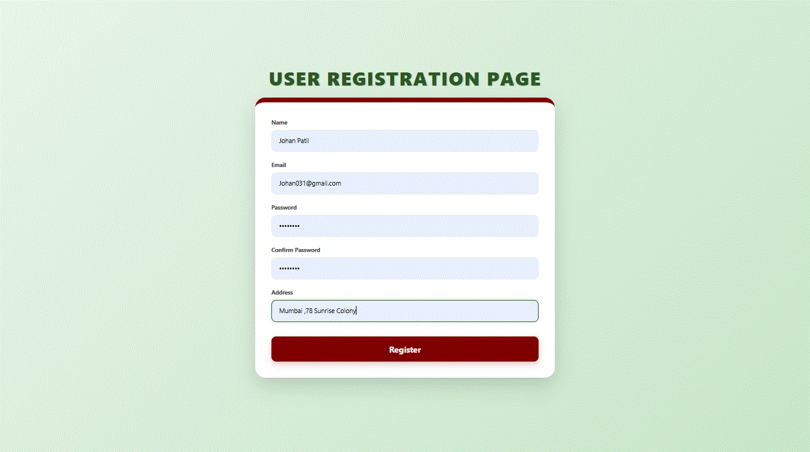
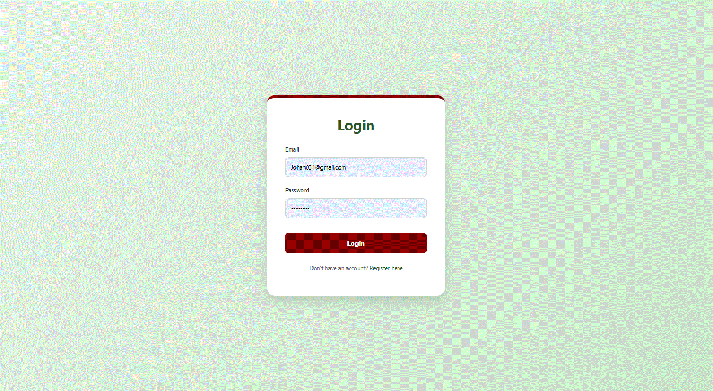
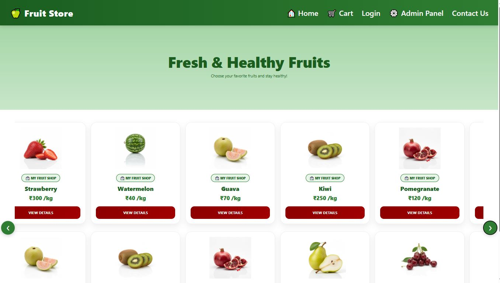
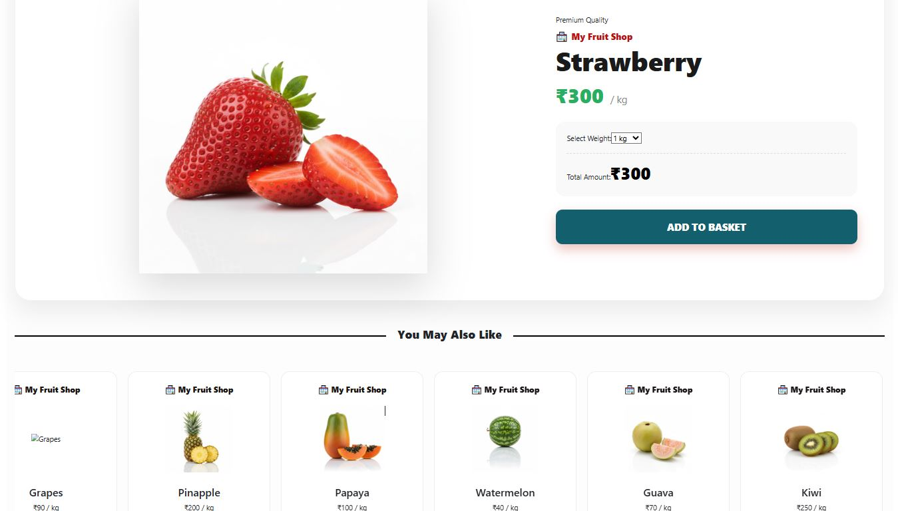
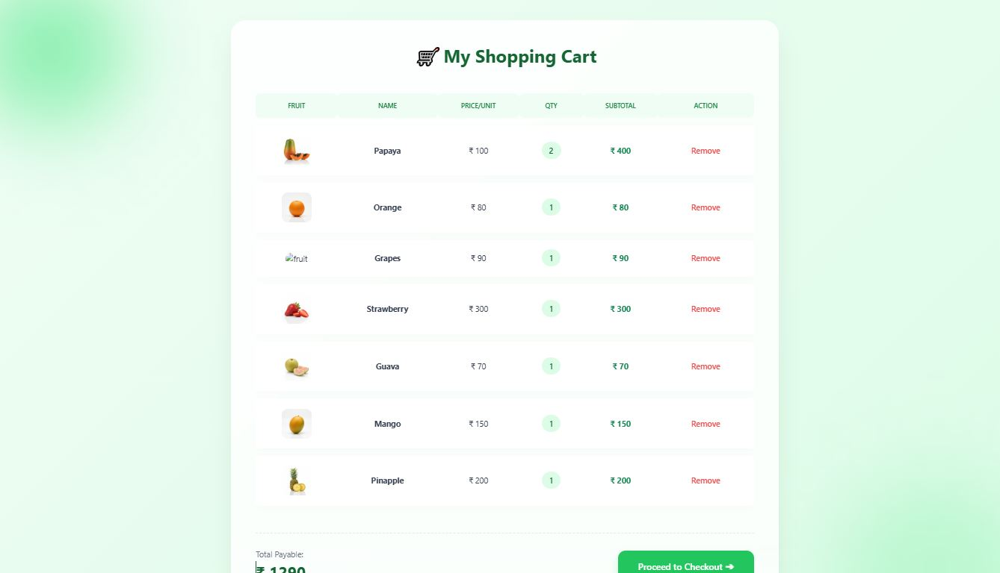
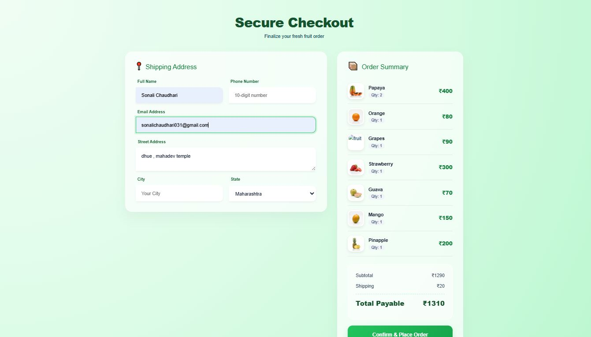
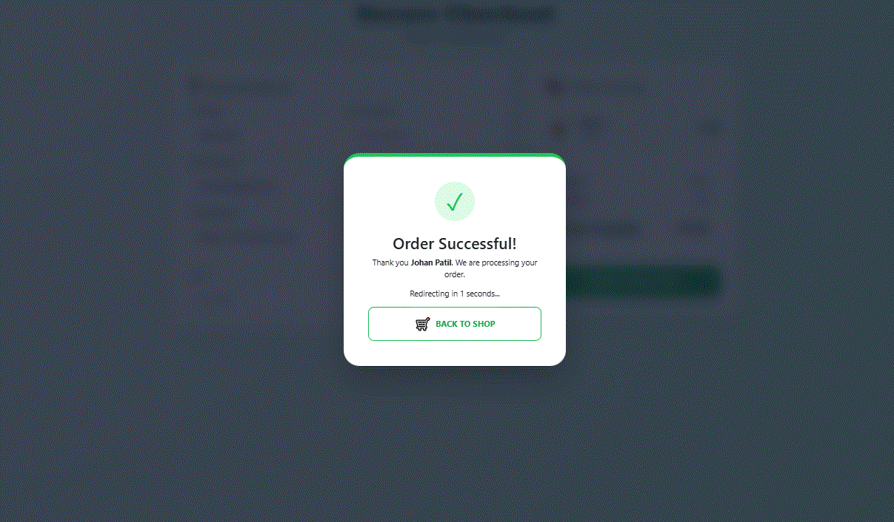
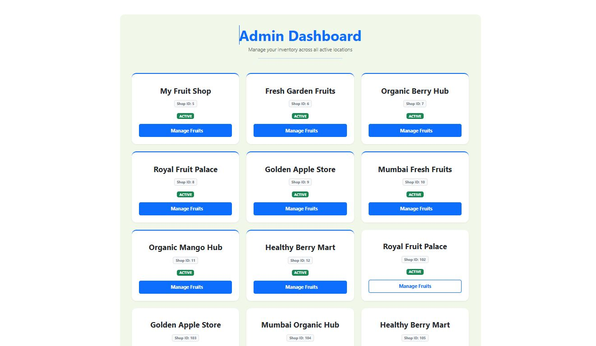
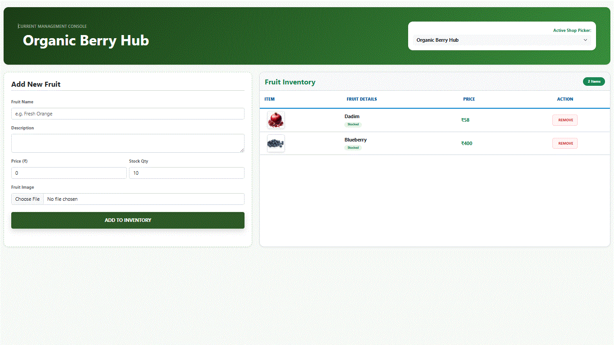
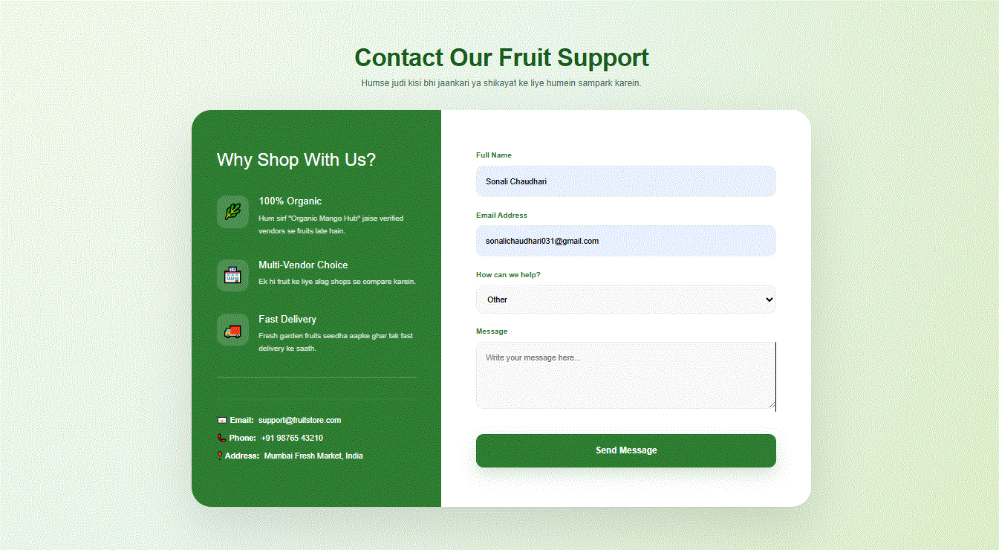

# 🍎 Online Fruit Store Web Application

A full-stack e-commerce web application developed for buying fresh fruits online.  
This application allows users to register, login, browse fruits, view product details, add items to cart, and manage shopping activities.

## 🚀 Features

- User Registration and Login
- Browse available fruits
- View fruit details with images and prices
- Add fruits to cart
- Select product quantity/weight
- Update and manage cart items
- Calculate total cart price
- Responsive user interface

## 🛠️ Technologies Used

### Frontend
- Angular
- HTML5
- CSS3
- Bootstrap

### Backend
- Java
- Spring Boot
- Spring Data JPA
- Hibernate
- RESTful APIs

### Database
- MySQL

## 📂 Project Structure

1. Frontend (Angular)
   - Components
   - Services
   - Models
   - Routing

2. Backend (Spring Boot)
   - Controller
   - Service
   - Repository
   - Entity

3. Database (MySQL)
   - onlinefruitstore database

## ⚙️ Installation and Setup

Follow these steps to run the Online Fruit Store Web Application locally.

### Prerequisites

- Java JDK 17
- Node.js and npm
- Angular CLI
- MySQL Database
- Eclipse / IntelliJ IDEA

### Step 1: Clone Repository

git clone https://github.com/sonalichaudhari031/Online-Fruit-Store-Webapplication.git

### Step 2: Frontend Setup (Angular)

Go to frontend folder:

cd frontend

Install dependencies:

npm install

Run Angular application:

ng serve

Frontend will run on:

http://localhost:4200

### Step 3: Backend Setup (Spring Boot)

Open backend project in Eclipse/IntelliJ IDEA.

Configure MySQL database connection.

Update database details in:

src/main/resources/application.properties

Database configuration example:

spring.datasource.url=jdbc:mysql://localhost:3306/onlinefruitstore

spring.datasource.username=root

spring.datasource.password=your_password

spring.jpa.hibernate.ddl-auto=update

Run Spring Boot application.

Backend will run on:

http://localhost:8080

### Step 4: Database Setup (MySQL)

Open MySQL Workbench.

Create database:

CREATE DATABASE onlinefruitstore;

Update MySQL username and password in application.properties.

Run backend application.

Hibernate will automatically create required tables.

### Step 5: Run Application

1. Start MySQL Server.

2. Start Spring Boot Backend.

3. Start Angular Frontend using:

ng serve

4. Open browser:

http://localhost:4200

The Online Fruit Store Web Application is successfully running.

## 🔗 API Endpoints

### Fruit APIs

Get All Fruits

GET /api/fruits

Get Fruit By ID

GET /api/fruits/{id}

### User APIs

Register User

POST /api/users/register

Login User

POST /api/users/login

### Cart APIs

Add Product To Cart

POST /api/cart/add

## 📸 Screenshots

### 🏠 Home Page
The landing page of the application showcasing fresh fruits, featured products, and easy navigation for users.

### 🔐 User Registration Page
New users can create an account securely by providing their personal details and credentials.

### 🔑 Login Page
Registered users can securely log in to access personalized shopping features and manage orders.

### 🍎 Fruit List Page
Displays all available fruits with images, pricing, and product information for easy browsing.

### 📦 Product Detail Page
Provides detailed information about selected fruits, including price, description, and available quantity options.

### 🛒 Cart Page
Allows users to review selected products, update quantities, and view the total purchase amount before checkout.

### 💳 Checkout Page
A streamlined checkout process where users can confirm order details and complete purchases.

### 📋 Order Page
Displays order summaries and purchase details, helping users track their shopping activities.

### 👨‍💼 Admin Dashboard
Administrative panel for monitoring application activities and managing store operations efficiently.

### 🍓 Fruit Management Page
Enables administrators to add, update, delete, and manage fruit inventory through a centralized interface.

### 📞 Contact Us Page
Provides a communication channel for users to send queries, feedback, or support requests.

